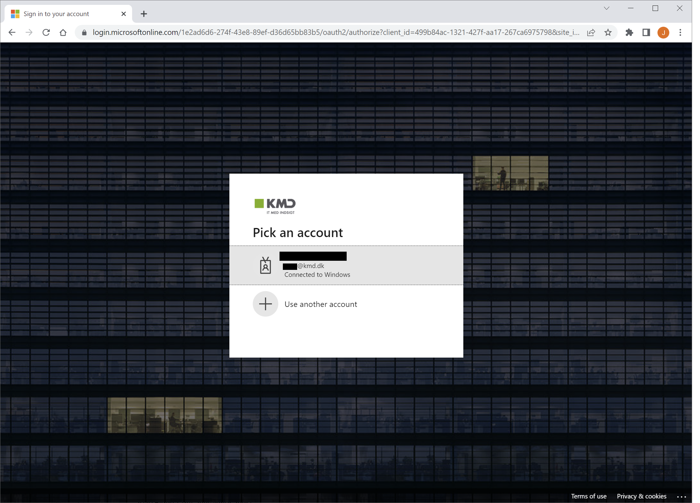
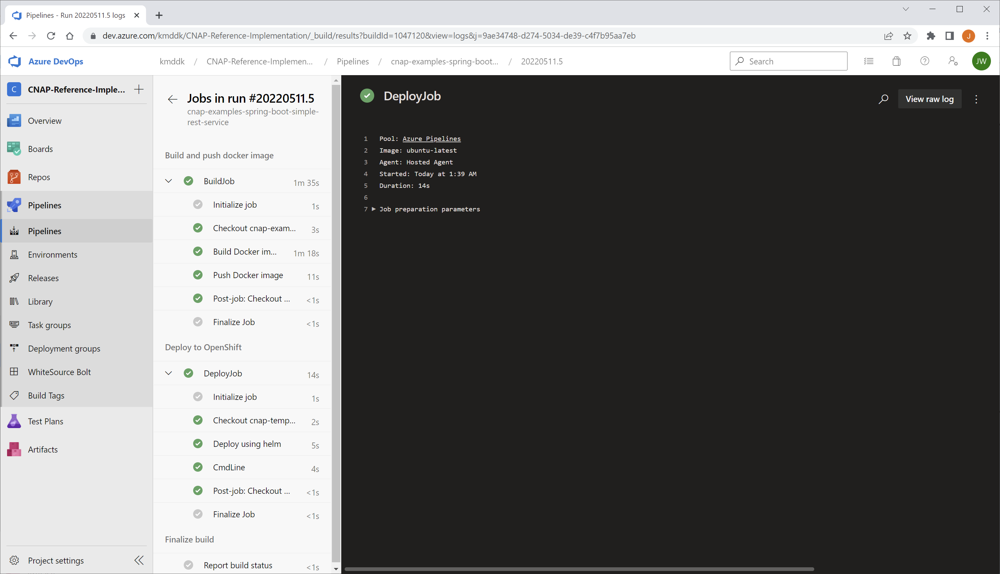
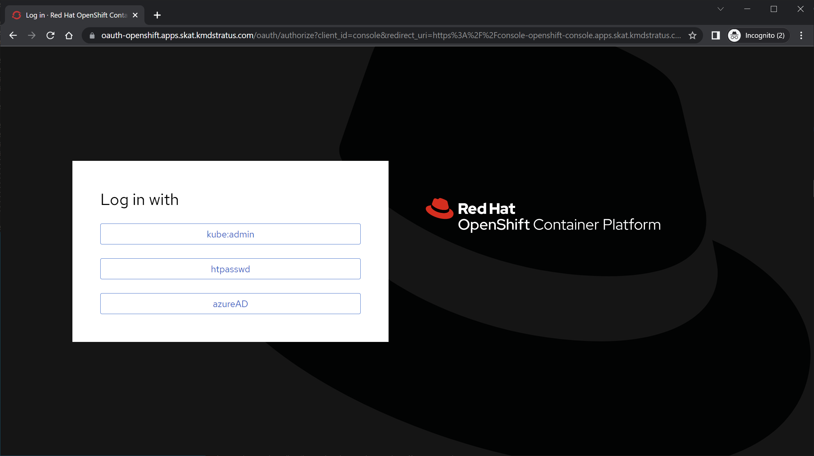
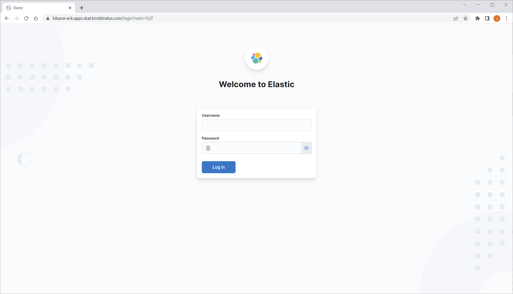
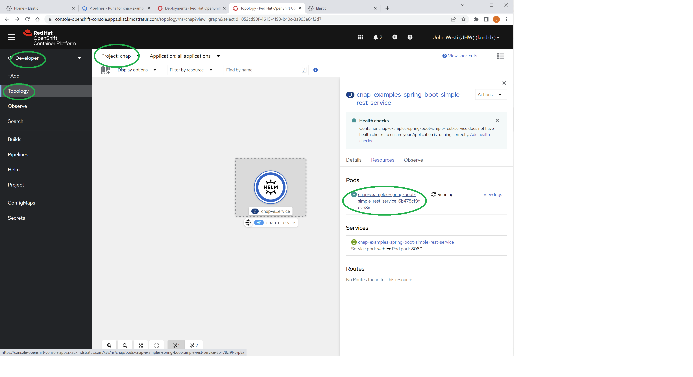
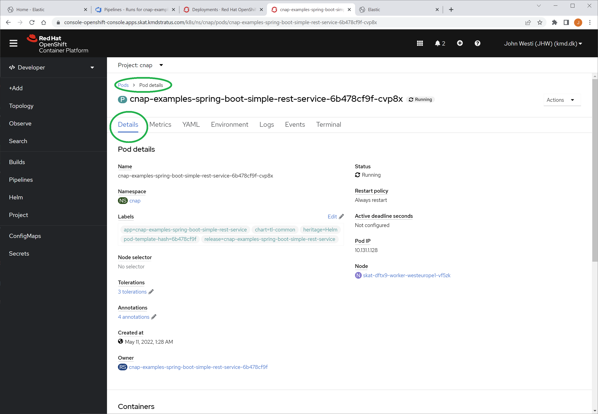
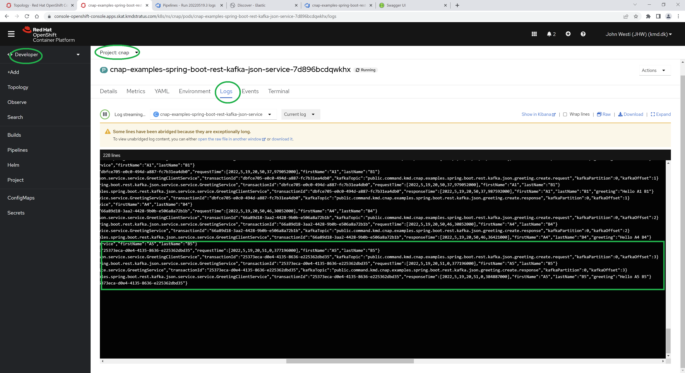
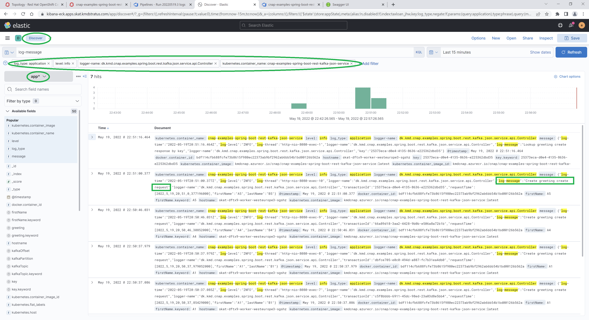
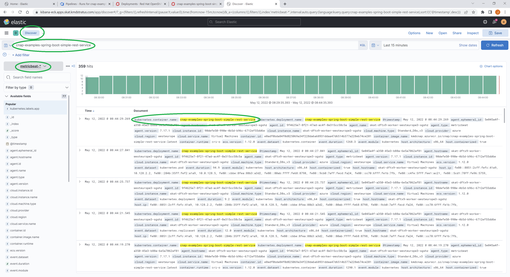

# CNAP Examples - Spring Boot Rest Kafka Json Service 
## Project purpose
The purpose of this project is to show an example of a *Java Spring Boot* application deployed in an *OpenShift* cluster implementing a Rest API.  
The code is kept at a minimum to implement a Rest API using a Spring Service that simply logs activity and responds with plain text messages.
The service 

## Prerequisites

### Overview

| Prerequisite            | Description                                                                                                                                                                   |
|-------------------------|-------------------------------------------------------------------------------------------------------------------------------------------------------------------------------|
| Azure Devops access     | You need developer access to [Azure Devops](https://dev.azure.com/kmddk/CNAP-Reference-Implementation) for working with project resources, CI/CD pipelines, repositories etc. |
| OpenShift access        | You need developer access to [OpenShift](https://console-openshift-console.apps.skat.kmdstratus.com/) for operating OpenShift cluster, inspect deployments etc.               |
| ELK access              | You need developer access to [ELK](https://kibana-eck.apps.skat.kmdstratus.com/) for exploring logs etc.                                                                        |
| Java SDK                | Install [Java SE 11](https://openjdk.java.net/projects/jdk/11/) locally                                                                                                       |
| Java IDE                | Install a Java IDE of your choice locally (say [IntelliJ](https://www.jetbrains.com/idea/))                                                                                   |
| curl data transfer tool | Install [curl](https://curl.se/) locally to interact with the Rest API                                                                                                        |
| OpenShift CLI           | Install [OpenShift CLI](https://docs.openshift.com/container-platform/4.7/cli_reference/openshift_cli/getting-started-cli.html) locally to operate *OpenShift* cluster        |

### Logging in to Azure Devops
Open https://dev.azure.com/kmddk/CNAP-Reference-Implementation and login page is shown



Use your KMD AD account and follow steps to authenticate.

Now you can explore the resources like for example the CI/CD pipeline that builds and deploys this example.



### Logging in to OpenShift cluster
Open https://dev.azure.com/kmddk/CNAP-Reference-Implementation and login page is shown  



Use your KMD AD account and follow steps to authenticate.

### Logging in to ELK
Open https://kibana-eck.apps.skat.kmdstratus.com/ and login page is shown  



## Implementation

### Application
*SpringBootRestKafkaJsonApplication* is the Spring Boot application to be run

### Services
The Spring Boot services are
* *Controller*   
   Rest API controller to publish Kafka request and lookup consumed Kafka response.   
* *GreetingClientService*  
   A *@Service* assisting the *Controller* by acting as a client of the *GreetingService* using request-reply semantics over Kafka.  
* *GreetingService*  
   A service generating a personalized greeting as response to the supplied names in the request.

### Interfaces

## Rest API
The Rest API implemented by the *Controller* class provides the following get methods

| Path          | Get method description                                                                                                                                            |
|---------------|-------------------------------------------------------------------------------------------------------------------------------------------------------------------|
| /api/request  | Publish a *GreetingCreateRequest* on Kafka to request *GreetingService* to generate a new greeting message for the supplied *firstName* and *lastName* parameters. |
| /api/response | Look up a *GreetingCreateResponse* already consumed from Kafka using the message key which in effect is *transactionId* of the initiating *GreetingCreateRequest* |

## Kafka

### Kafka Messages & Topics
In this example each message type is published on separate topic so the following 1-to-1 relations exists:

| Message                    | Topic                                                                                 |
|----------------------------|---------------------------------------------------------------------------------------|
| GreetingCreateRequest | public.command.kmd.cnap.examples.spring.boot.rest.kafka.json.greeting.create.request  |
| GreetingCreateResponse | public.command.kmd.cnap.examples.spring.boot.rest.kafka.json.greeting.create.response |

All topics are automatically created using *TopicBuilder*  
Number of replicas and partitions are configured in *application.yml*

#### Topic Naming convention
In general a topic name is composed of dot separated constituents on the format
```
<visibility>.<message-type>.<domain>.<sub-domain>.*.<version>
```
*visibility* : private | public  
*message-type* : command | event  
*domain* : kmd.cnap.examples  
*sub-domain* : examples.spring.boot.rest.kafka.json 

The * are one or more parts after *sub-domain* specific to the needs.

*version* is the last part of the topic name and is a version number.  
The initial version (version 0) is implied and not present.
Additional versions are added as numbers.

An example of a specific part for an entity CRUD operation
```
*.<entity-name>.<operation>.<direction>.*
```
*entity-name* : greeting | account | ?  
*operation* : create | read | update | delete


For command topics the direction is added as

direction = request | response

#### Topic examples
#### 1) *public.command.kmd.cnap.examples.spring.boot.rest.kafka.json.greeting.create.request*

*public* means the topic is intended for clients of the component in question  
*command* means messages are in fact commanding the component to do something  
*kmd.cnap.examples* is the CNAP Examples domain within KMD  
*spring.boot.rest.kafka.json* is the sub-domain specifying the specific CNAP example

The topic is for *create* operations on the *greeting* entity within *spring.boot.rest.kafka.json* CNAP Example.

The component implements a request-response command pattern with requests on this topic example as indicated by the *request* part.  
This request topic is matched by a corresponding response topic named *public.command.kmd.cnap.examples.spring.boot.rest.kafka.json.greeting.create.response*

As the request and response topics are the initial versions no version number is present in the topic name.


## Implementation dependencies
The implementation depends on the *Spring Boot Starter Web* library as a simple way to run a web server exposing a Rest API interface.  
This is achieved by using the annotations :
* @SpringBootApplication - used to mark the *SpringBootRestApplication* Java class as a Spring Boot application
* @RestController - used to mark the *Controller* Java class as an implementation of a Rest API with additional annotations specify paths and parameters.

## Deployment dependencies
The *org.springframework.boot* plugin is applied in the *build.gradle* to provide the *bootBuildImage* task used in CI/CD pipeline when building *OCI* image for deployment in the *OpenShift* cluster. 

## Logging
Spring Boot logs various information using the *logback* logging framework.  
The framework is configured by the *logback.xml* file to allow all log statements at INFO level or above (ERROR and FATAL) to the standard console.  
The example code is kept simple by using the same logging framework.

## Building the example

### Build tool
This example uses the [gradle build tool](https://gradle.org/) [wrapper](https://docs.gradle.org/current/userguide/gradle_wrapper.html) to execute the build script.
The build script is located the *build.gradle* file and associated settings in *settings.gradle* defines the name of the build as *cnap-examples-spring-boot-simple-rest-service*

Locally a clean build is done by executing the wrapper build script from the root directory of the example.  
Depending on the host OS use on Windows :
```
gradlew clean build
```

and on Linux :
```
./gradlew.sh clean build  (Linux)
```

### CI/CD pipeline
This example is automatically build and deployed by Azure DevOps using the pipeline defined in the *azure-pipelines.yml* file.

The project pipeline references the *azure-stage-build-and-deploy.yml* CNAP [template](https://docs.microsoft.com/en-us/azure/devops/pipelines/process/templates?view=azure-devops) which in effect reuses/imports the content, logic and parameters defined in the template.  
The *azure-stage-build-and-deploy* template itself references other templates within the same [cnap-templates-pipeline-azure](https://dev.azure.com/kmddk/CNAP-Reference-Implementation/_git/cnap-templates-pipeline-azure) repository.
In addition references are also made to *Helm* oriented templates which are defined in [cnap-templates-helm](https://dev.azure.com/kmddk/CNAP-Reference-Implementation/_git/cnap-templates-helm) repository.

As the majority of parameters defined in the *azure-stage-build-and-deploy* template have default values leaving just a few mandatory parameters to be provided.  
Consequently the *image* and *service* parameters are defined by the project pipeline to specify the name of the image artifact and service.

* Build the application and produce *docker* image using the *gradle* *bootBuildImage* task
* Upload *docker* image to Azure Container Repository (ACR)
* Install and update *Helm* template in *OpenShift* cluster using above *docker* image from ACR

## Running the example locally
### Within an IDE 
Execute the *main()* method in *SpringBootSimpleRestServiceApplication*  
When the example is running locally the Rest Endpoint is available at *http://localhost:8080*

### In console using gradle
Use gradle wrapper to execute the *run* task as
```
gradle run (Windows)
```
or
```
./gradlew.sh run  (Linux)
```

When the example is running locally the Rest Endpoint is available at *http://localhost:8080*

###  Remotely using port forward
Ensure the *oc* OpenShift Cluster CLI is installed.

When example is deployed and running in OpenShift Cluster use the *oc* CLI to

1. oc login -u *user* -p *password* --server=https://api.skat.kmdstratus.com:6443
2. oc port-forward service/cnap-examples-spring-boot-simple-rest-service 8080:8080

When above steps are done the example running in the OpenShift CLuster the Rest Endpoint is available at *http://localhost:8080*

## Using the example
In below examples *curl* is used with the example Rest Endpoint at *http://localhost:8080*

### Get default message
```
>curl http://localhost:8080/
This is the default message from spring-boot-simple-rest-service
```
### Get health
```
>curl http://localhost:8080/api/health
The health of spring-boot-simple-rest-service is fine
```
### Get echo
```
>curl http://localhost:8080/api/echo?message=Hello
spring-boot-simple-rest-service echoes the provided message : "Hello"
```

## OpenShift cluster operations
Here are some examples on what kind of information can found on from https://console-openshift-console.apps.skat.kmdstratus.com/ 

### OpenShift cluster topology
The topology of the OpenShift cluster can be found here for the namespace in question 



### OpenShift pod details
Clicking on a pod (say within the topology overview) shows some details like



### OpenShift pod logging
In the pod details pane the logging can be found




## ELK operations
The ELK stack is used for log ingestion and visualisation.  
Here are some examples on what can be found on https://kibana-eck.apps.skat.kmdstratus.com/

### Kibana discover app logging


### Kibana discover metrics logging

